<h2 align="center">ＢＯＯＴＩＮＧ　ＰＲＯＦＩＬＥ… ✅</h2>

<code>INIT</code> → <code>LOAD</code> → <code>RUN</code>

### 👨‍💻 About
CS + Data Science student focused on building things that are **correct**, **efficient**, and **data-driven**.

- 🧠 Interests: data structures & algorithms, data analysis, database design
- 🛠️ I work with: Python (data/automation), Java (OOP + DSA), R (stats/analysis), Bash (scripting)
- 🗃️ Databases: SQL + RDBMS concepts (joins, keys, normalization, indexing, schema design)
- ✅ Workflow: version control with Git/GitHub, development in VS Code + Replit

### 🧰 Tech Stack

  

<!--
**invisible-doctor2810/invisible-doctor2810** is a ✨ _special_ ✨ repository because its `README.md` (this file) appears on your GitHub profile.

Here are some ideas to get you started:

- 🔭 I’m currently working on ...
- 🌱 I’m currently learning ...
- 👯 I’m looking to collaborate on ...
- 🤔 I’m looking for help with ...
- 💬 Ask me about ...
- 📫 How to reach me: ...
- 😄 Pronouns: ...
- ⚡ Fun fact: ...
-->
